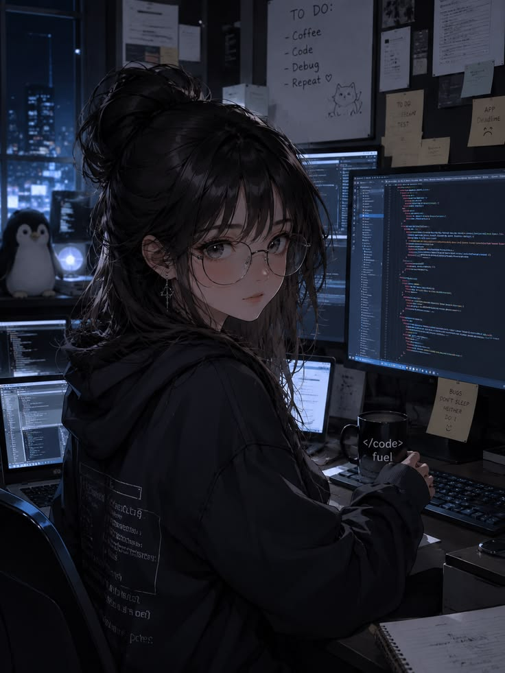

<!-- ✧･ﾟ BANNER ﾟ･✧ -->
<div align="center">


<a href="https://github.com/RebeAyalaG">
  
</a>

<br/>


</div>

<!-- ✿ IMAGEN CENTRADA ✿ -->
<div align="center">

</div>

<!-- ✿ DIVIDER ✿ -->


## 🌸 `whoami`

```yaml
👩‍💻 rol:    Full Stack Developer
🎓 soy:    Ingeniera en Informática 🏅
💻 stack:  React · Angular · Spring · Node · Python
💖 foco:   pagos, integraciones, automatización, cloud
✨ lema:   "aprender algo nuevo cada día"
```


## 💻 Mi Setup Tecnológico

<div align="center">

<br/>
<br/>


</div>


## 🚀 Dónde he sumado experiencia

<div align="center">

| 🏢 | Rol | Highlights |
|:--:|:----|:-----------|
| **BrosCo** <br/> `Ago 2024 → hoy` | Full Stack Dev | ⚛️ React/TS · ☕ Spring Boot · 💳 pagos (QR/Bancard) · 🐍 automatización Python · 🐳 Docker |
| **Taller de Ideas** <br/> `2022 → 2024` | Full Stack Dev | 🅰️ Angular · ☁️ microservicios AWS · 🔐 Spring Security · 🗄️ Oracle · 📱 Flutter |

</div>


## 🎀 Mi Ruta de Aprendizaje

> Cada insignia es un curso que completé 💗 ¡Aprender nunca se detiene!

<div align="center">

### 🩷 Platzi


### 💜 dev/talles


### 💗 Sololearn


### 🌸 Coursera


### 🎀 Sistema E-Learning


</div>


## 👑 Formación & Logros

<div align="center">

🎓 **Ingeniería en Informática** — Univ. Columbia del Paraguay · 🏅 *Egresada Distinguida*
🏫 **Bachillerato Científico** — Colegio Nacional Héroes de la Patria · 🏅 *Mejor Alumna 2015–2017*

</div>


## 🌟 Más allá del código

<div align="center">

`⏱️ Gestión del tiempo` · `🤝 Colaboración` · `🔄 Adaptabilidad`
`🧩 Resolución de problemas` · `📚 Aprendizaje continuo` · `🌐 Multi-entorno`

</div>


## 📊 GitHub en movimiento

<div align="center">


</div>

<br/>

<!-- 🐍 SNAKE: se llena a medida que sumás contribuciones -->
<div align="center">


</div>


## 💌 Hablemos

<div align="center">

[](mailto:rebeayalag@gmail.com)
[](https://www.linkedin.com/in/delcia-rebecca-ayala-gimenez/)
[](https://github.com/RebeAyalaG)

<br/>


</div>

